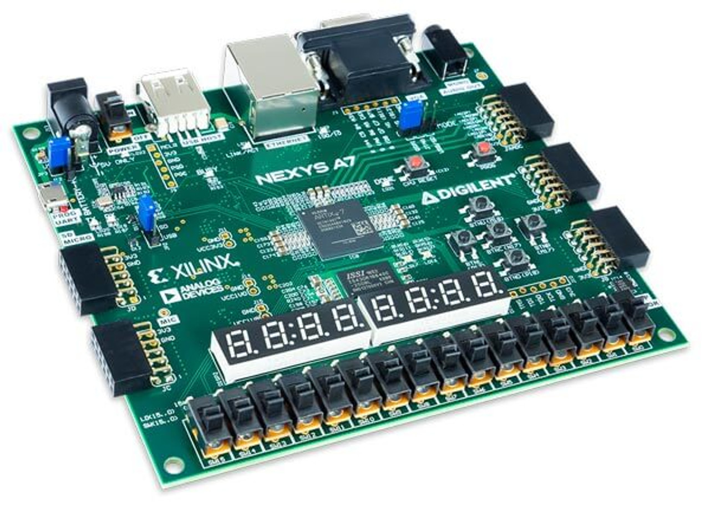

# FPGA_Projects

This Repository is to showcase Saif Alomari's FPGA projects

- Saif Alomari
- B.S. in Computer Engineering 
- Los Angeles, California

In this Repository, there is a collection of high-level projects: 

- SystemVerilog (2024):
    - 1- Barrel Shifter
    - 2- Programmable Square Wave Generator
    - 3- Early Denouncer Circuit
    - 4- ROM-based-temperature-conversion
    - 5- FIFO Buffer
    - 6- SoC_Chasing_LED_Function
    - 7- SoC_Blinking_LED_Core
    - 8- SoC_ADC_Chasing_LED_Function

- Verilog (2023):
    - 1- Full Adder
    - 2- 7segments Display
    - 3- Counter using 7segments display
    - 4- Persistence_of_Vision_Project
    - 5- Digital Clock
    - 6- Sound Generator
    - 7- Alarm Clock
    - 8- FSM Debouncing Circuit
    - 9- FSMD Bit Counting Circuit
    - 10- Data Transmission
    - 11- FSM Questions Game

The SystemVerilog Projects and files in this repository are based on the excellent text by Pong Chu FPGA Prototyping by SystemVerilog Examples (Xilinx MicroBlaze MCS SoC Edition). 

The projects in this Repository were implemented on the ”Nexys A7-100T” FPGA trainer board by DIGILENT (previously known as the Nexys 4 DDR).

