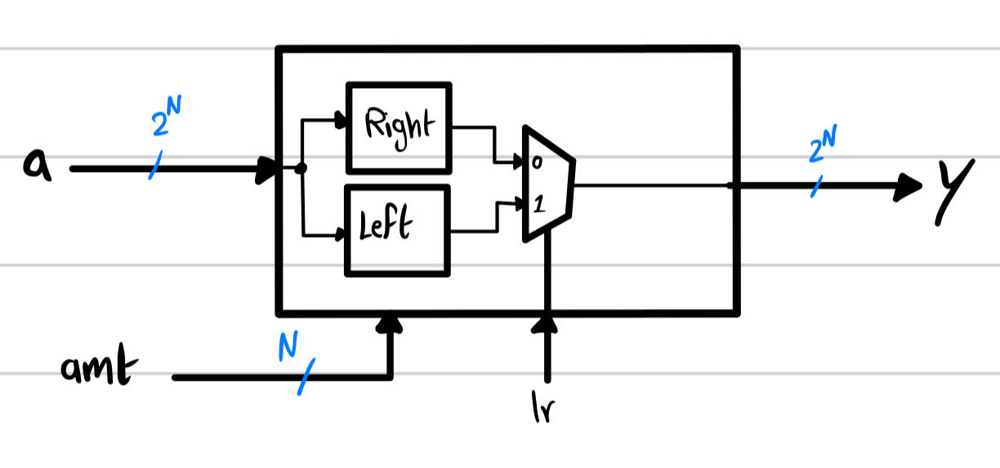
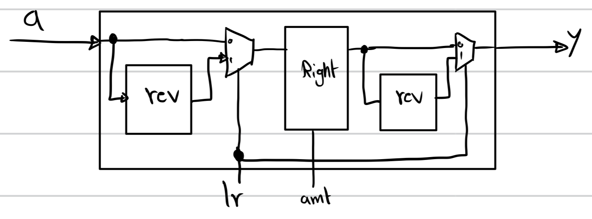

# Barrel Shifter 

A barrel shifter is a digital circuit that can shift binary data by a specified number of positions in a single clock cycle. It gets its name from the conceptual analogy of rotating a barrel to shift its contents.

Barrel shifters are commonly used in digital signal processing (DSP), microprocessor architectures, and other digital systems where efficient data manipulation is required. They are often found in arithmetic and logic units (ALUs) within processors.

The main advantage of a barrel shifter is its ability to perform shifts of multiple bits in parallel, which can significantly improve performance compared to serial shifters. This parallelism is achieved through a combination of multiplexers and logical gates arranged in a barrel-like structure.

Functionality of the Barrel Shifter: 
- Example 1 (Right barrel shift): 
    - input:        `a = 0110_1101`
    - shift amount: `amt = 3`    
    - output:        `y = 1010_1101`

- Example 2 (left barrel shift):
    - input:        `a = 0110_1101`
    - shift amount: `amt = 3`    
    - output:        `y = 0110_1011`

Multi-Function Barrel Shifter: (shifts right and left using a mux) 

Multi-Function Barrel Shifter using a reverser: (shift right and left using a mux and reverser module)

