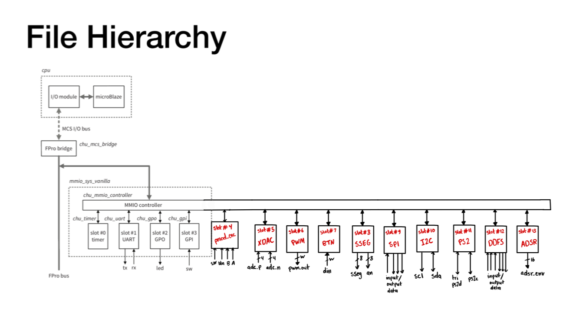
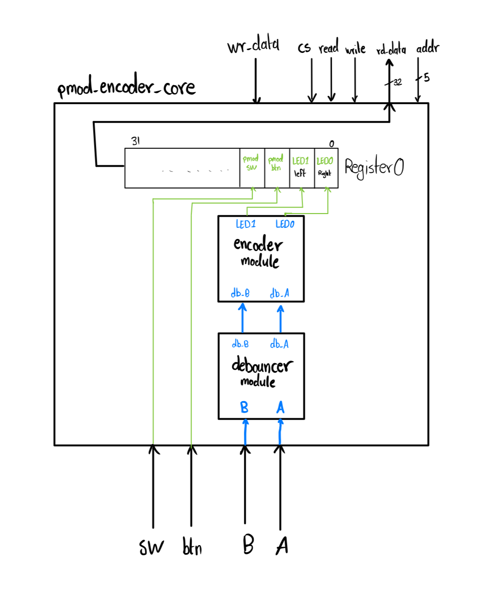
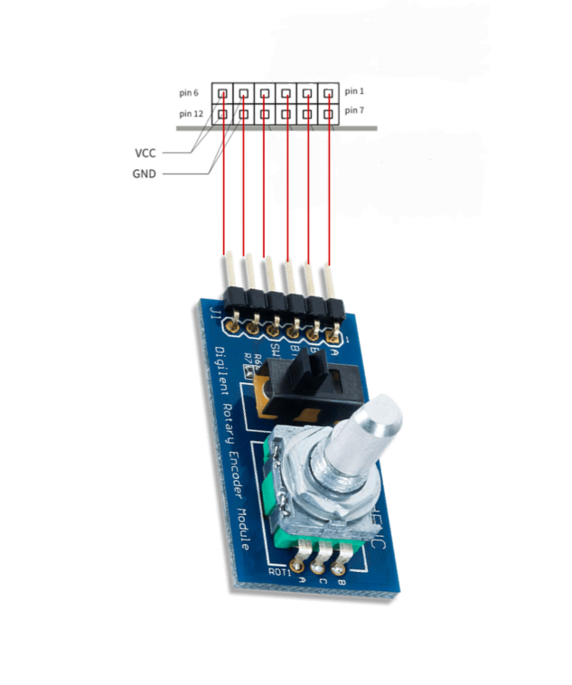

# SoC_Pmod_Rotary_Encoder_Control - Saif Alomari

About FPGA-based SoC:

A “high-end” embedded system usually has a processor and simple I/O peripherals to perform general user interface and housekeeping tasks and special hardware accelerators to handle computation-intensive operations. These components can be integrated into a single integrated circuit, commonly referred to as an SoC (system on a chip). As the capacity of FPGA devices continues to grow, the same design methodology can be realized in an FPGA chip. Instead of just realizing the system functionalities through customized software, we can incorporate customized hardware into the embedded system as well. The FPGA technology allows us to tailor the processor, select only the needed I/O peripherals, create a custom I/O interface, and develop specialized hardware accelerators for computation-intensive tasks.

The FPro system is composed of those major parts shown in the diagram down below:
- Processor module: The processor module consists of a processor, a memory controller core, and RAM. It is the part that is constructed from the vendors’ IP cores.
- FPro bridge and FPro bus: The processor needs to communicate with other cores. This is done by a bus or interconnect structure specified in the vendor’s IP platform. The modern interconnect is designed to accommodate a wide variety of communication and data transfer needs and involves complex protocols.
- MMIO (memory-mapped I/O) subsystem: The MMIO subsystem provides a framework to accommodate memory-mapped general-purpose and special I/O peripherals as well as hardware accelerators.

The Sampler Diagram (Made by HDL): 

The cores that were used to accomplish the work: 
- 1- pmod_enc_core (to get the readings from the Pmod encoder rotary)
- 2- pwm_core (to control the RGB lights)
- 3- Sseg_core (to display the degree of the color)

The pmod_enc_core HDL diagram: 

# Application Level: 

In this project, the `rgb_controlled_pmod` function manages an interactive RGB LED display using various inputs to change colors and intensity dynamically. It begins by reading encoder inputs to control individual LEDs and set the initial color state with a button press, cycling through blue, green, and red. A second feature allows intensity adjustments for each color through rotary encoder inputs, affecting the PWM duty cycle to modify LED brightness. These changes are displayed in real-time on a seven-segment display, showing the current intensity levels for each color. This setup demonstrates complex input handling and real-time feedback integration on an FPGA board, showcasing the flexibility of hardware interfaces in creating responsive and customizable LED displays.

Demo of the project on the FPGA board:

Wiring Diagram (from the pmod_encoder to the JA pins):

