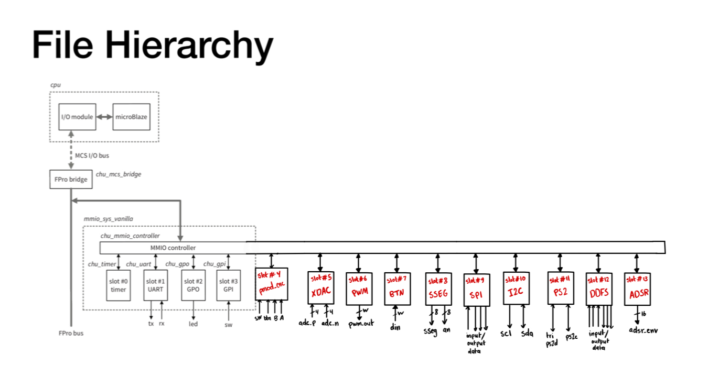
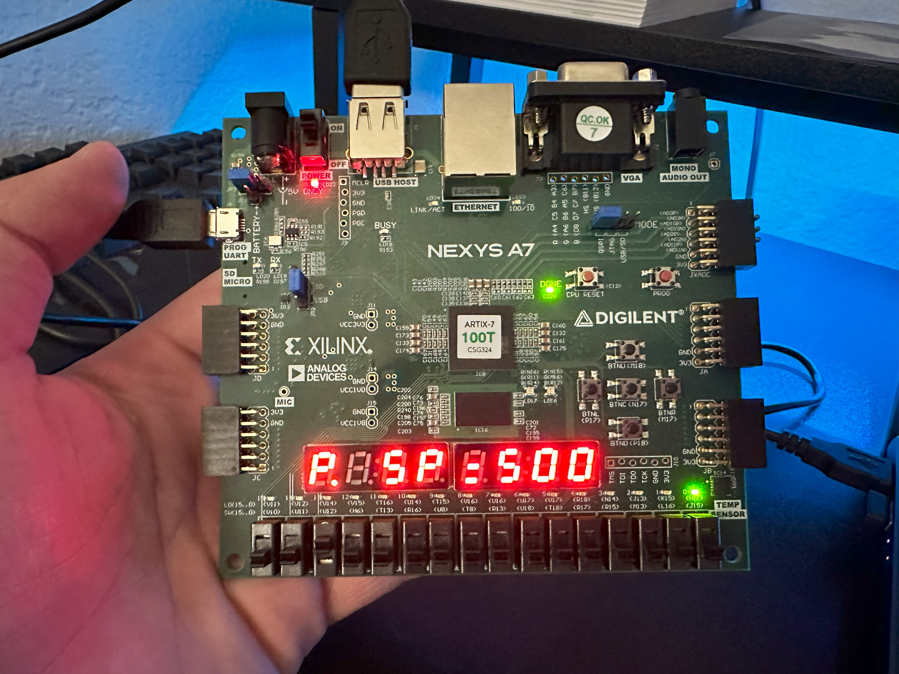
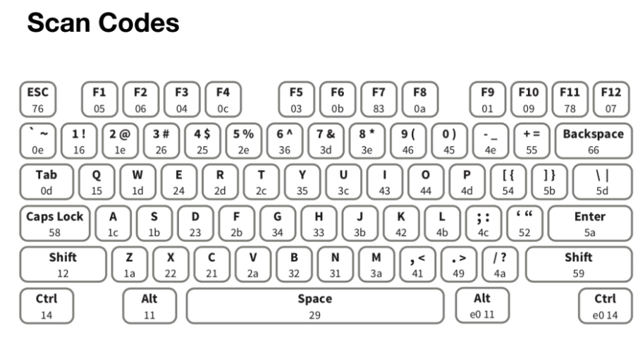

# SoC_Keyboard_Chasing_LED_Function - Saif Alomari

About FPGA-based SoC:

A “high-end” embedded system usually has a processor and simple I/O peripherals to perform general user interface and housekeeping tasks and special hardware accelerators to handle computation-intensive operations. These components can be integrated into a single integrated circuit, commonly referred to as an SoC (system on a chip). As the capacity of FPGA devices continues to grow, the same design methodology can be realized in an FPGA chip. Instead of just realizing the system functionalities through customized software, we can incorporate customized hardware into the embedded system as well. The FPGA technology allows us to tailor the processor, select only the needed I/O peripherals, create a custom I/O interface, and develop specialized hardware accelerators for computation-intensive tasks.

The FPro system is composed of those major parts shown in the diagram down below:
- Processor module: The processor module consists of a processor, a memory controller core, and RAM. It is the part that is constructed from the vendors’ IP cores.
- FPro bridge and FPro bus: The processor needs to communicate with other cores. This is done by a bus or interconnect structure specified in the vendor’s IP platform. The modern interconnect is designed to accommodate a wide variety of communication and data transfer needs and involves complex protocols.
- MMIO (memory-mapped I/O) subsystem: The MMIO subsystem provides a framework to accommodate memory-mapped general-purpose and special I/O peripherals as well as hardware accelerators.

The Sampler Diagram (Made by HDL): 

The cores that were used to accomplish the work: 
- 1- Ps2_core (to get the code bits from the keyboard).
- 2- GPO_core (to display the chasing LED).
- 3- Sseg_core (to display the outputs to the user).

# Application Level: 

In this project, the function `chase_LED_keyboard` controls a series of LEDs to create a dynamic chasing light effect, now managed via keyboard input rather than analog control. This version replaces the potentiometer and ADC with a PS2 keyboard interface to adjust the speed of the LEDs. Users can interactively modify the speed and pause or resume the light chase using specific keyboard keys. This digital input is processed in real time, demonstrating a seamless integration of user interfaces with digital logic on an FPGA board. The ability to toggle the direction of the chase adds an additional layer of interaction, making this project a practical example of how digital inputs can replace analog ones to control and visualize dynamic systems effectively.

Demo of the project on the FPGA board:
- `P` (for pause).
- `SP = 500` (for speed 000 to 999).

Keyboard with scan codes pins:
- pressing `p` pauses the chasing_led.
- pressing `F1` moves to the adjusting speed session.

