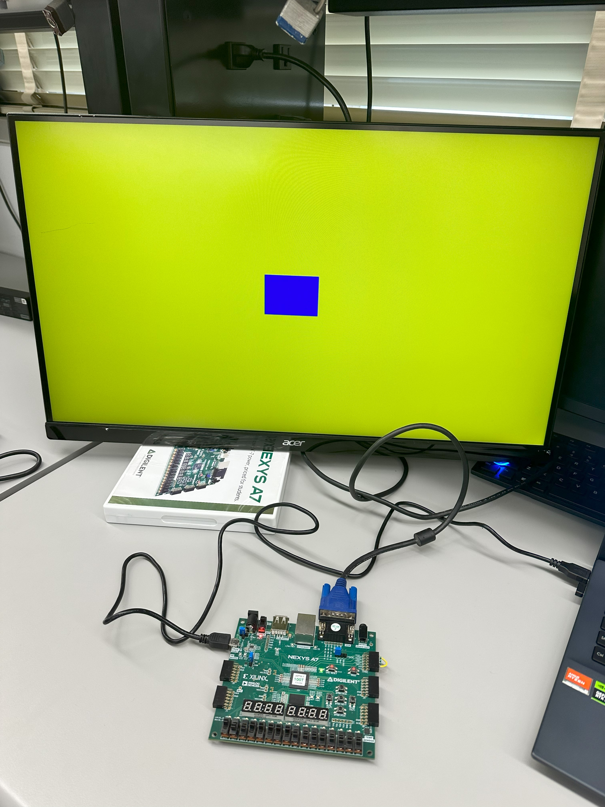

# VGA Demo Square Generator - Saif Alomari

The vga_demo project is a comprehensive digital design implemented on FPGA, aimed at manipulating VGA output through user-defined controls. 
This module integrates various components to render a customizable visual output on a VGA monitor. Utilizing input switches, users can adjust 
background colors and select visual patterns like bars or grayscale effects. The module's core includes a pattern generator (square_demo) that dynamically 
adjusts the size and color of a central square based on input settings. Additionally, it features a color-to-gray conversion circuit (rgb2gray) to facilitate 
grayscale display, enhancing the versatility of the visual output. A video synchronization circuit (vga_sync_demo) ensures proper timing and synchronization 
for the display, handling horizontal and vertical sync signals along with RGB data output. User interactions are further refined through multiplexers that 
choose between direct color or modified visual effects, offering a rich, interactive experience suitable for educational demonstrations or creative visual displays.

## VGA demo system diagram: 

## Examples of squares on the VGA screen: 

Example 1: blue square with 16 pixels width:

Example 2: Red square with 64 pixels width:

Example 2: Green square with 32 pixels width:

