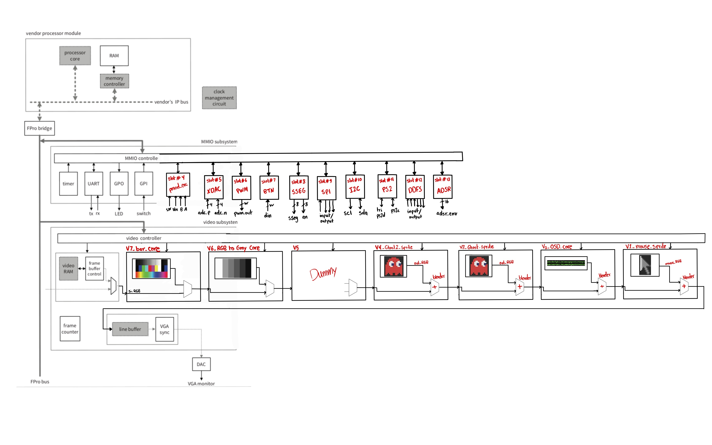
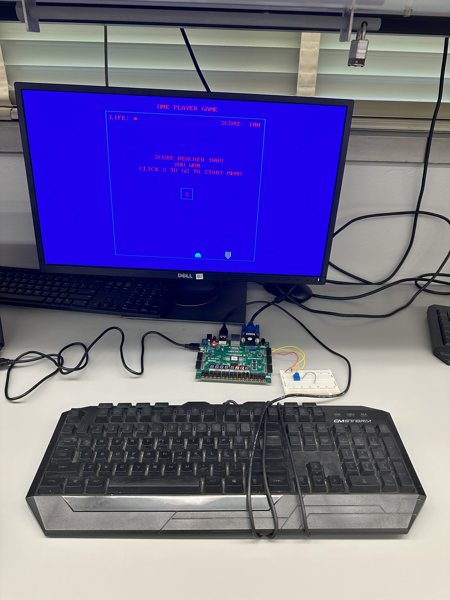
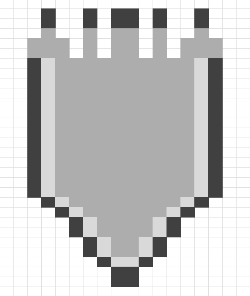

# SoC_Final_Project_Dynamic_Game - Saif Alomari

About FPGA-based SoC:

A “high-end” embedded system usually has a processor and simple I/O peripherals to perform general user interface and housekeeping tasks and special hardware accelerators to handle computation-intensive operations. These components can be integrated into a single integrated circuit, commonly referred to as an SoC (system on a chip). As the capacity of FPGA devices continues to grow, the same design methodology can be realized in an FPGA chip. Instead of just realizing the system functionalities through customized software, we can incorporate customized hardware into the embedded system as well. The FPGA technology allows us to tailor the processor, select only the needed I/O peripherals, create a custom I/O interface, and develop specialized hardware accelerators for computation-intensive tasks.

The complete system is composed of those major parts shown in the diagram down below:
- Processor module: The processor module consists of a processor, a memory controller core, and RAM. It is the part that is constructed from the vendors’ IP cores.
- FPro bridge and FPro bus: The processor needs to communicate with other cores. This is done by a bus or interconnect structure specified in the vendor’s IP platform. The modern interconnect is designed to accommodate a wide variety of communication and data transfer needs and involves complex protocols.
- MMIO (memory-mapped I/O) subsystem: The MMIO subsystem provides a framework to accommodate memory-mapped general-purpose and special I/O peripherals as well as hardware accelerators.
- Video subsystem: The video subsystem controls what is being controlled to the VGA screen and it consists of 8 cores that can be displayed on the screen.

The Complete System Diagram (Made by HDL): 

# Application Level: 

## The rocket bit map: 

