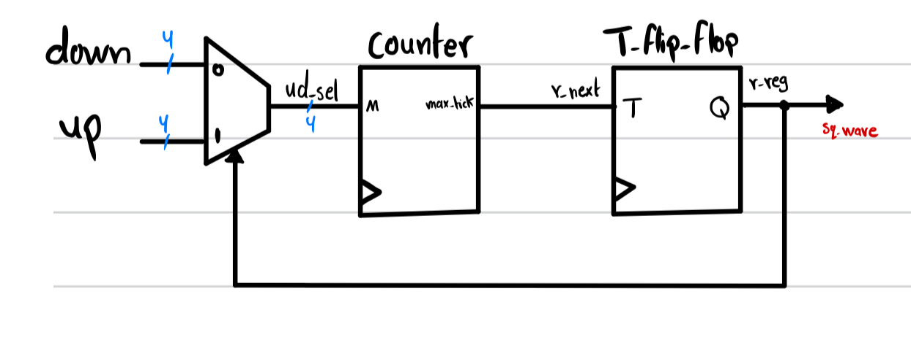
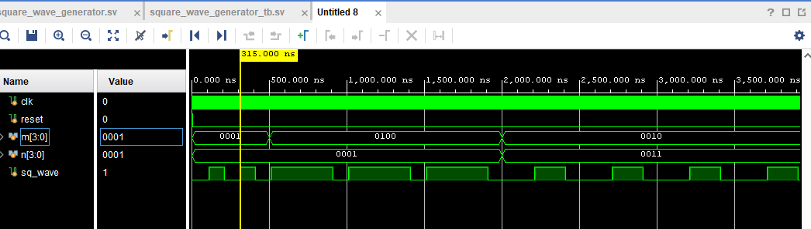

# Programmable Square Wave Generator - Saif Alomari

A Programmable Square Wave Generator is a device or circuit capable of producing square wave signals with adjustable parameters such as frequency, duty cycle, and amplitude.

Square waves are characterized by their distinct on-off pattern, where the signal alternates between two voltage levels (usually high and low) at regular intervals. This makes them useful in various applications such as digital communication, signal processing, instrumentation, and testing.

- Examples:
  - if `up = 0100` and `down = 0001`, that transleates to 40ms on and 10ms off.
  - if `up = 0001` and `down = 0001`, that transleates to 10ms on and 10ms off.
  - if `up = 0010` and `down = 0101`, that transleates to 20ms on and 50ms off.

My design: 

Screenshot of output simulation: 
m = on cycles
n = off cycles

