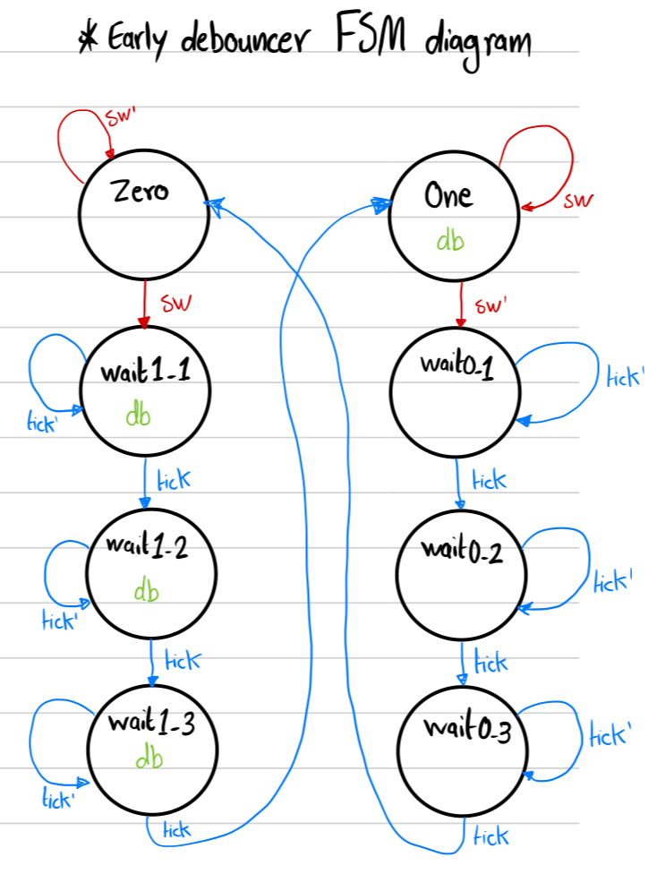
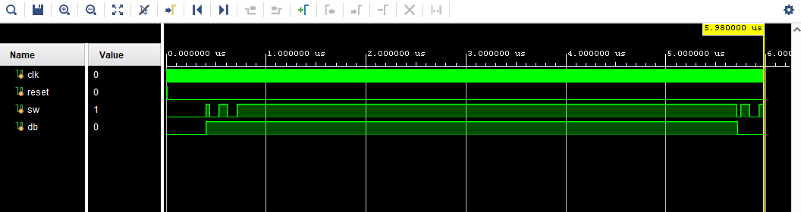

# Early Debouncer Circuit - Saif Alomari

Debouncing circuits are used in digital electronics to remove noise or bounce from the input signal, especially in applications where mechanical switches are used. Delayed and early debouncer circuits are variations of debouncing circuits that aim to address specific timing issues in the signal transition.

In an early debouncer circuit, the output signal reacts faster than the input signal. This means that the output signal stabilizes before the input signal has completely settled. An early debouncer circuit can be beneficial when it's crucial for the output signal to respond quickly, such as in high-speed switching applications or where rapid response to signal changes is required.

Early Debouncer FSM Diagram:

Screenshot from the simulation: 

