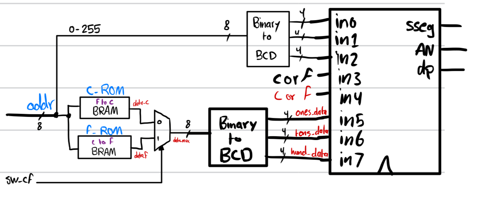

# ROM-based-temperature-conversion

In this project, I constructed a circuit that uses on-board DRAM to act like ROM.

Our Design:

Examples of our output using the constructed circuit:
The right 4 segments are the input (address)
The left 4 segments are the output (data)

1- First Example: Converting from Fahrenheit (acts as an input address) to Celsius (output)
 - `In this case, we input an address under 32f which is a negative degree in Celsius, so it displays a 0c`

2- Second Example: Converting from Fahrenheit (acts as an input address) to Celsius (output) 
  - `In this case address is between 32f and 212f, so it displays an output`

  
3- Third: Converting from Fahrenheit (acts as an input address) to Celsius (output)
  - `In this case, the address max 212f which is 100c`

4- Fourth: Converting from Celsius (acts as an input address) to Fahrenheit (output)
  - `In this case, the address is under 100c`

5- Fifth: Converting from Celsius (acts as an input address) to Fahrenheit (output)
  - `In this case, the address is above 100c (out-of-range)`

