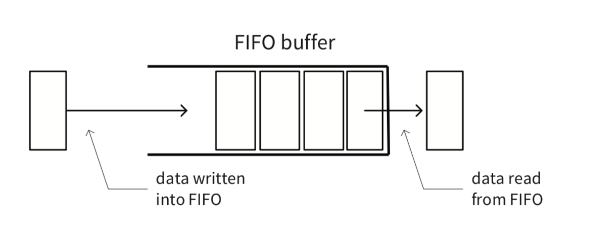
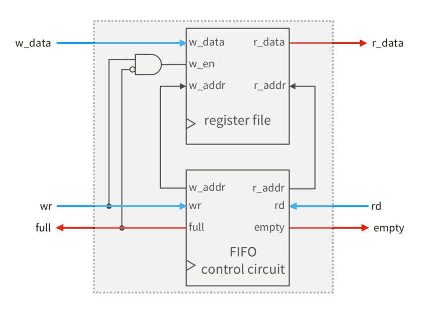

# FIFO Buffer

A FIFO buffer, also known as a first-in, first-out buffer, is a data structure used in electronics to manage data transmission between two processes or devices. It operates on the principle that the data that enters the buffer first will be the first to exit.
FIFO buffers are often used in scenarios where there is a difference in the rate of data production and consumption, acting as a temporary storage mechanism to smooth out these differences. 

An asymmetric FIFO buffer is a variant of the traditional FIFO buffer where the read and write operations are not symmetrical and data sizes are not symmetrical.

The design of the FIFO Buffer (8-bit input, 8-bit output): 

The design of the Asymmetric FIFO Buffer (16-bit input, 8-bit output): 

`------------------------------------------------------------------------------------------------------------`

Screenshot of the simulation output: 

Zoomed-in screenshot of the simulation output (part 1): 

Zoomed-in screenshot of the simulation output (part 2): 

